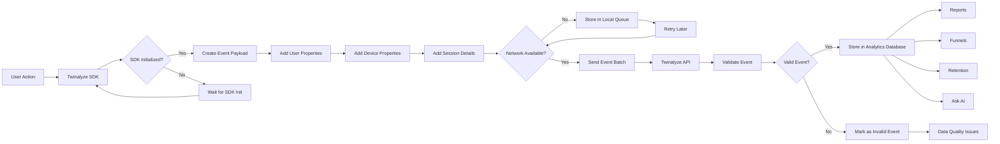
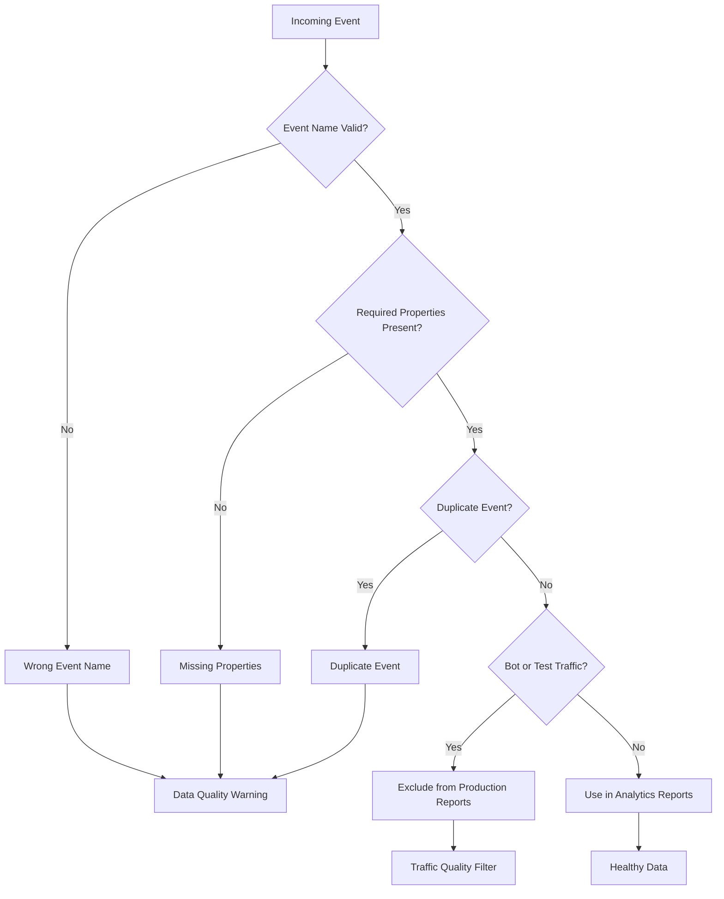
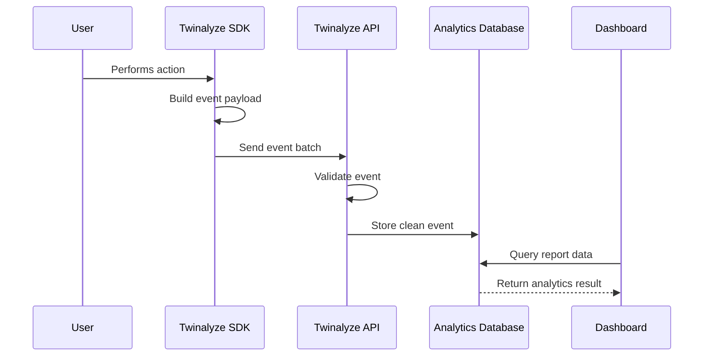

This page explains how event data flows from your website or app into Twinalyze.

Use the diagram below to understand the complete journey.

---

## Twinalyze event flow



---

## How to read this flow

<Steps>
  <Step title="User performs an action">
    A user opens a screen, clicks a button, starts checkout, completes payment, or triggers any important event.
  </Step>
  <Step title="SDK prepares event data">
    Twinalyze SDK adds user, device, session, platform, and event properties.
  </Step>
  <Step title="Event is sent to Twinalyze">
    If network is available, the event is sent to Twinalyze. If not, it can be queued and retried later.
  </Step>
  <Step title="Twinalyze validates data">
    Twinalyze checks event names, required properties, missing values, and duplicate signals.
  </Step>
  <Step title="Reports are updated">
    Clean events are used in reports, funnels, retention, users, and Ask AI.
  </Step>
</Steps>

---

## Data quality decision flow



---

## Event processing sequence



---

## Example event payload

```json
{
  "eventName": "checkout_started",
  "userId": "user_123",
  "deviceId": "device_456",
  "sessionId": "session_789",
  "properties": {
    "cartValue": 2499,
    "currency": "INR",
    "itemCount": 3,
    "platform": "web",
    "environment": "production"
  }
}
```

<Tip>
  Mermaid diagrams are useful for SDK setup, event flow, backend architecture, data quality, and onboarding documentation
</Tip>

<Tree />

<Tabs>
  <Tab title="Tab 1">
    <Steps>
      <Step>
      </Step>
    </Steps>
  </Tab>
  <Tab title="Tab 2">
  </Tab>
</Tabs>

<ResponseExample>

```text filename
```

</ResponseExample>